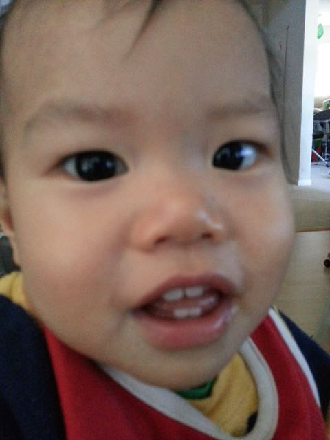
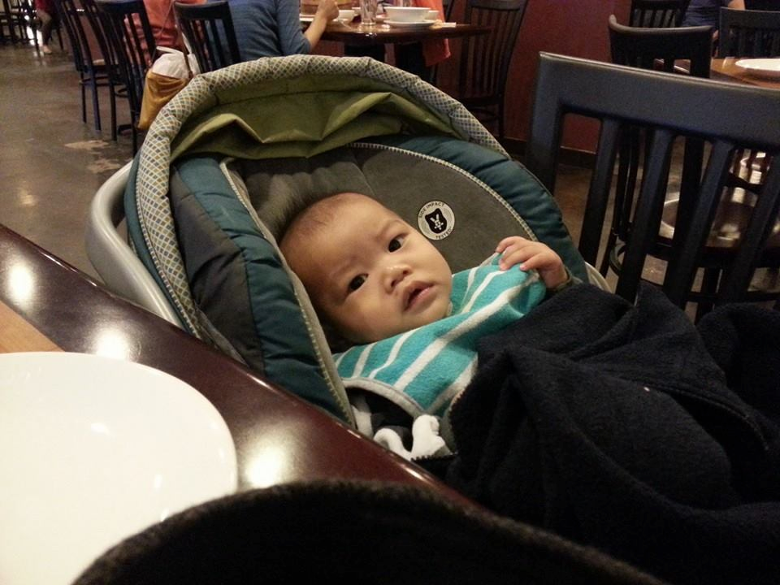
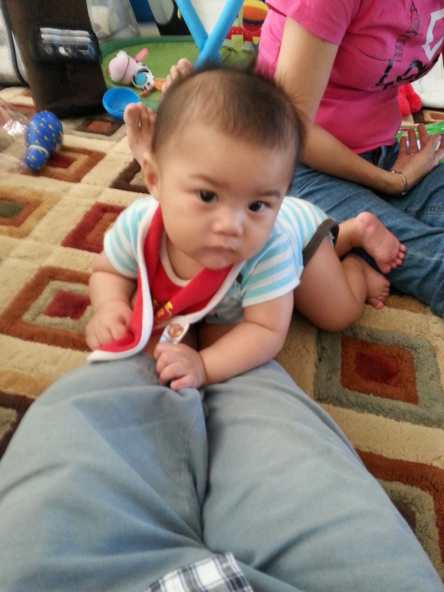

---
title       : Name That Kid!
subtitle    : 
author      : 
job         : 
framework   : io2012        # {io2012, html5slides, shower, dzslides, ...}
highlighter : highlight.js  # {highlight.js, prettify, highlight}
hitheme     : tomorrow      # 
widgets     : [bootstrap, quiz, mathjax]            # {mathjax, quiz, bootstrap}
mode        : selfcontained # {standalone, draft}
knit        : slidify::knit2slides

--- &radio

## Picture 1

1. Ethan
2. Noah
3. _Daniel_

*** .hint 

Teeth
*** .explanation 

taken in apr 2015.  hit arrow for next slide.

--- &radio

## Picture 2

1. Ethan
2. Noah
3. _Daniel_

*** .hint 

none
*** .explanation 

hit right arrow for next slide.

--- &radio

## Picture 3

1. Ethan
2. _Noah_
3. Daniel

*** .hint 

none
*** .explanation 

hit right arrow for next slide.

--- &radio

## Picture 4

1. Ethan
2. _Noah_
3. Daniel

*** .hint 

none
*** .explanation 

hit right arrow for next slide.

--- &radio

## Picture 5

1. _Ethan_
2. Noah
3. Daniel

*** .hint 

none
*** .explanation 

hit right arrow for next slide.

--- &radio

## Picture 6

1. Ethan
2. _Noah_
3. Daniel

*** .hint 

none
*** .explanation 

hit right arrow for next slide.

--- &radio

## Picture 7

1. _Ethan_
2. Noah
3. Daniel

*** .hint 

none
*** .explanation 

hit right arrow for next slide.

--- &radio

## Picture 8

1. Ethan
2. Noah
3. _Daniel_

*** .hint 

none
*** .explanation 

hit right arrow for next slide.

--- &radio

## Picture 9

1. Ethan
2. Noah
3. _Daniel_

*** .hint 

none
*** .explanation 

hit right arrow for next slide.

--- &radio

## Picture 10

1. _Ethan_
2. Noah
3. Daniel

*** .hint 

none
*** .explanation 

hit right arrow for next slide.

--- &radio

## Picture 11

1. Ethan
2. _Noah_
3. Daniel

*** .hint 

none
*** .explanation 

hit right arrow for next slide.

--- &radio

## Picture 12

1. Ethan
2. Noah
3. _Daniel_

*** .hint 

none
*** .explanation 

hit right arrow for next slide.

--- &radio

## Picture 13

1. Ethan
2. Noah
3. _Daniel_

*** .hint 

none
*** .explanation 

hit right arrow for next slide.

--- &radio

## Picture 14

1. Ethan
2. Noah
3. _Daniel_

*** .hint 

none
*** .explanation 

hit right arrow for next slide.

--- &radio

## Picture 15

1. Ethan
2. Noah
3. _Daniel_

*** .hint 

none
*** .explanation 

hit right arrow for next slide.

--- &radio

## Picture 16

1. Ethan
2. _Noah_
3. Daniel

*** .hint 

none
*** .explanation 

hit right arrow for next slide.

--- &radio

## Picture 17

1. Ethan
2. _Noah_
3. Daniel

*** .hint 

none
*** .explanation 

hit right arrow for next slide.

--- &radio

## Picture 18

1. _Ethan_
2. Noah
3. Daniel

*** .hint 

none
*** .explanation 

hit right arrow for next slide.

